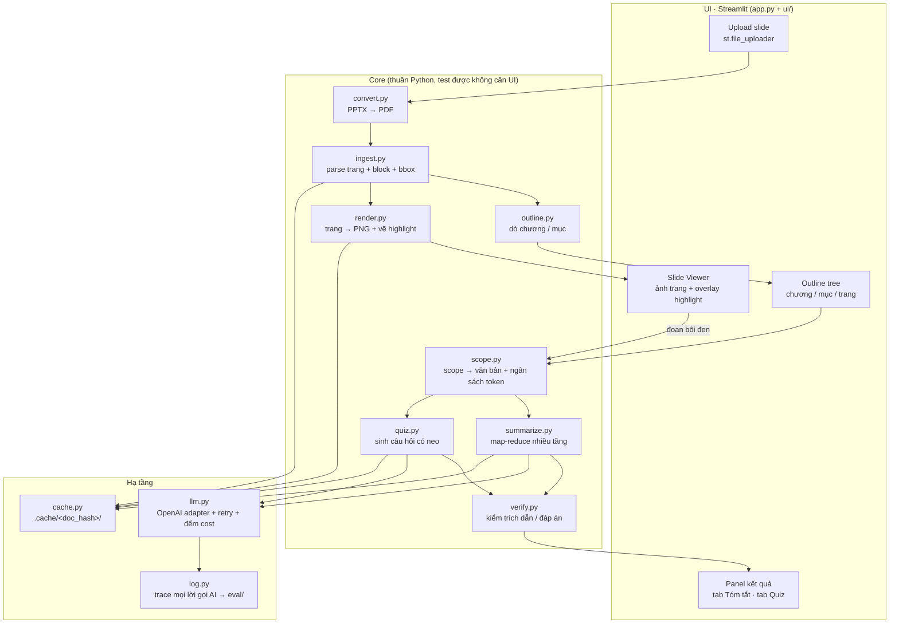
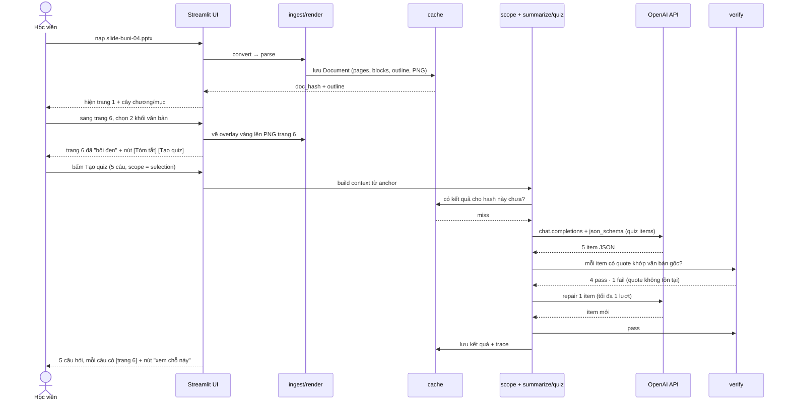
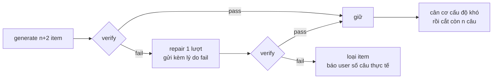

# ARCHITECTURE — Trợ lý Ôn Slide *(tên làm việc · đổi thoải mái)*

> Tài liệu kiến trúc kỹ thuật cho prototype hackathon Batch 03. Phần "vì sao chọn thế này" theo góc sản phẩm nằm ở `spec.md`; file này chỉ trả lời **hệ thống chạy thế nào**.
> Danh sách tính năng và tiêu chí nghiệm thu từng tính năng: `FEATURES.md`.

---

## 1. Tổng quan một phút

Người dùng nạp file slide bài giảng vào ứng dụng, xem slide ngay trong cửa sổ, chọn phạm vi cần ôn (toàn bộ / chương / mục / trang / đoạn bôi đen) rồi nhận **bản tóm tắt có neo trang** hoặc **bộ câu hỏi ôn tập có trích dẫn nguồn**.

| Hạng mục | Chốt |
|---|---|
| Stack | **Streamlit** (Python) — một process, một file `app.py` là entrypoint |
| LLM | **OpenAI API** (`openai` SDK) qua một lớp adapter `core/llm.py` |
| Input | **PDF** (đường chính) + **PPTX** (convert sang PDF trước khi vào pipeline) |
| Parse / render | PyMuPDF (`fitz`) — text theo block + bbox, render trang ra PNG |
| Mức prototype | **Mock → Working**: viewer + ingest chạy thật trên file thật, AI thật ở lõi tóm tắt và sinh quiz |
| Lát cắt demo | *Học viên ôn trước quiz · bôi đen một đoạn slide chưa chắc · AI sinh 5 câu hỏi kiểm tra hiểu có trích dẫn trang · học viên tự phát hiện chỗ mình hổng* |
| Không có trong prototype | tài khoản/đăng nhập, DB, deploy, đồng bộ nhiều máy, chấm điểm học viên |

**Ranh giới cần nhớ:** đây không phải chatbot Q&A tự do trên tài liệu. Mọi lời gọi AI đều bị đóng khung trong **một scope xác định trước** do người dùng chọn bằng UI — điều này là quyết định kiến trúc quan trọng nhất, vì nó biến bài toán "retrieval đúng chỗ" (khó, dễ sai) thành bài toán "cắt đúng lát văn bản" (xác định, kiểm được).

---

## 2. Sáu nguyên tắc kiến trúc

1. **Scope là cấu trúc, không phải tìm kiếm.** Chương/mục/trang/đoạn bôi đen đều quy về một `unit_id` có thật trong tài liệu. Không embedding, không vector DB ở mức prototype — người dùng đã chỉ đúng chỗ cần đọc.
2. **Không output nào không có neo nguồn.** Mỗi gạch đầu dòng tóm tắt và mỗi câu quiz mang theo `anchor` = (trang, block/đoạn) + một câu trích nguyên văn. Không neo được thì không hiển thị.
3. **Generator và verifier tách rời.** Model sinh nội dung; một lớp kiểm tra bằng code (không phải bằng model) đối chiếu trích dẫn với văn bản gốc. Lớp ① "nguồn sự thật" được canh bằng string matching, không bằng niềm tin vào prompt.
4. **Cache theo nội dung, không theo thời điểm.** Khoá cache = `hash(nội dung scope) + prompt_version + model`. Nhờ vậy tóm tắt toàn tài liệu tái dùng tóm tắt từng trang, và sửa prompt là tự động invalidate đúng phần bị ảnh hưởng.
5. **UI là hàm thuần của `session_state`.** Streamlit chạy lại toàn bộ script sau mỗi tương tác — mọi thứ đắt (parse, render, gọi AI) phải nằm trong cache hoặc `session_state`, tuyệt đối không nằm thẳng trong luồng render.
6. **Prompt là file có version, không phải string trong code.** `prompts/*.v1.md`; đổi prompt là tăng version + ghi changelog `spec.md §9`. Kết quả eval luôn gắn với version prompt đã chạy.

---

## 3. Sơ đồ hệ thống



**Luật phụ thuộc:** `ui/` được phép import `core/`; `core/` **không bao giờ** import `streamlit`. Nhờ vậy toàn bộ logic chạy được từ dòng lệnh trong `eval/run.py` — đây là điều kiện để có bảng đo cho rubric R4.

---

## 4. Luồng chính — từ upload đến quiz



Điểm cần chú ý: **verify nằm trong luồng, không phải bước hậu kiểm tuỳ chọn.** Nếu sau một lượt repair vẫn fail, item bị loại và UI nói thẳng "chỉ tạo được 4/5 câu có căn cứ trong đoạn bạn chọn" — hành vi này là một trong các đường đi trải nghiệm khai trong `spec.md §6`.

---

## 5. Document model

```python
# core/models.py
@dataclass(frozen=True)
class Block:
    block_id: str        # "p06-b03"
    page_no: int         # 1-based, khớp số trang người dùng thấy
    order: int
    text: str
    bbox: tuple[float, float, float, float]
    font_size_max: float # dùng cho dò tiêu đề
    is_title_like: bool

@dataclass(frozen=True)
class Page:
    page_no: int
    blocks: list[Block]
    text: str            # blocks nối theo order
    png_path: str
    char_count: int      # < NGƯỠNG ⇒ trang thiên về hình, xử lý riêng

@dataclass(frozen=True)
class Section:
    unit_id: str         # "ch02-s03"
    title: str
    page_range: tuple[int, int]
    chapter_id: str

@dataclass(frozen=True)
class Chapter:
    unit_id: str         # "ch02"
    title: str
    page_range: tuple[int, int]
    sections: list[Section]

@dataclass(frozen=True)
class Document:
    doc_hash: str        # sha256 của bytes file gốc → khoá cache
    source_name: str
    source_kind: Literal["pdf", "pptx"]
    pages: list[Page]
    chapters: list[Chapter]
    outline_source: Literal["toc", "heuristic", "llm", "flat"]

@dataclass(frozen=True)
class Anchor:            # neo nguồn dùng chung cho mọi output
    page_no: int
    block_ids: list[str]
    quote: str           # ≤200 ký tự, phải khớp văn bản gốc

Scope = Literal["document", "chapter", "section", "page", "selection"]
```

**Quy ước `unit_id`** — `doc` · `ch02` · `ch02-s03` · `p06` · `p06-b03`. Mọi cache key, mọi trích dẫn, mọi dòng golden set đều nói bằng ngôn ngữ này. `page_no` luôn 1-based để số trong câu trích dẫn `[trang 6]` khớp đúng cái người dùng đang nhìn.

### Dò chương / mục — thang 4 bậc, dừng ở bậc đầu tiên thành công

| Bậc | Cách làm | Khi nào dùng được | Ghi vào `outline_source` |
|---|---|---|---|
| 1 | `doc.get_toc()` — bookmark có sẵn trong PDF | Slide export từ Keynote/LaTeX/Google Slides có mục lục | `toc` |
| 2 | Heuristic: block có `font_size_max` thuộc nhóm lớn nhất tài liệu + ở nửa trên trang ⇒ tiêu đề slide; trang có tiêu đề kiểu "Phần 2 / Chương 3 / Section" hoặc trang chỉ có 1 khối chữ lớn ⇒ mốc mở chương | Đa số slide bài giảng thực tế | `heuristic` |
| 3 | Một lời gọi AI duy nhất trên danh sách tiêu đề trang (không phải toàn văn) → gom nhóm thành chương/mục | Slide không có quy luật font | `llm` |
| 4 | Không có chương/mục — chỉ còn `document` và `page` | Slide 15 trang phẳng | `flat` |

Bậc 4 **không phải lỗi**. UI hiển thị "Tài liệu này không tách được chương/mục — tóm tắt theo trang và theo đoạn bôi đen vẫn dùng được", và hai tính năng tóm tắt theo chương/mục bị disable kèm lý do (nguyên tắc HAX **G1** — nói rõ hệ thống làm được gì, thay vì hiện nút bấm vào ra rác).

---

## 6. Ingest pipeline

```
bytes file
  └─ 1. hash → doc_hash; cache hit? → nạp lại từ .cache/, dừng
  └─ 2. nếu .pptx:
        a) soffice --headless --convert-to pdf --outdir <cache> file.pptx   (đường chính)
        b) fallback python-pptx: đọc text theo shape, dựng "trang giả" không layout
  └─ 3. fitz.open(pdf) → mỗi trang:
        page.get_text("dict")  → blocks (text, bbox, font size)
        page.get_pixmap(dpi=110) → PNG lưu .cache/<doc_hash>/png/p06.png
  └─ 4. lọc block rác: header/footer lặp lại >60% số trang, số trang đơn lẻ, block rỗng
  └─ 5. outline.py → chapters/sections (thang 4 bậc §5)
  └─ 6. ghi .cache/<doc_hash>/doc.json + manifest
```

| Quyết định | Lý do |
|---|---|
| Convert PPTX → PDF thay vì parse trực tiếp | Một pipeline duy nhất phía sau. `python-pptx` cho text nhưng không cho layout/ảnh trang — mà "hiển thị slide trong cửa sổ" là yêu cầu UI cốt lõi |
| DPI 110 | Đủ nét để đọc chữ trên slide ở panel viewer, nhẹ hơn 150 rõ rệt khi render 40 trang |
| Render **tất cả** trang lúc ingest, không lazy | Deck bài giảng thường 20-60 trang; render trước ~5-15s một lần, sau đó điều hướng tức thời — quan trọng cho 5 phút demo |
| Lưu PNG ra đĩa, không giữ trong RAM | Streamlit rerun liên tục; đường dẫn file đi qua `st.image` là rẻ nhất |

**Rủi ro đã biết:** bước 2a cần LibreOffice có trên máy demo. Xử lý: kiểm tra `shutil.which("soffice")` lúc khởi động và hiện cảnh báo sớm; **luôn convert sẵn file demo ra PDF làm backup** (checklist `02-guide.md §5.2`).

*Ghi chú license:* PyMuPDF là AGPL — với prototype hackathon không vấn đề gì, nhưng nếu sau này sản phẩm hoá thì đổi sang `pypdfium2` + `pdfplumber` (BSD/MIT).

---

## 7. "Bôi đen" trong Streamlit — thiết kế thật sự chạy được

Streamlit không có API bắt vùng text người dùng quét chuột. Kiến trúc vì vậy chia hai tầng, tầng 1 là đường demo chính.

### Tầng 1 — Block picker + overlay (bắt buộc, không cần JS)

```
Trang 6 hiện dưới dạng PNG đã vẽ overlay
        +
Danh sách khối văn bản của trang 6, mỗi khối một checkbox:
   ☐ b01  "Attention is all you need — ý tưởng chính"
   ☑ b03  "Query, Key, Value: mỗi token sinh ra ba vector..."
   ☑ b04  "Điểm attention = softmax(QKᵀ/√d)..."
        ↓
selected_block_ids = ["p06-b03", "p06-b04"]
        ↓
render.py: mở PNG bằng PIL, vẽ hình chữ nhật vàng alpha ~0.35 lên đúng bbox
        ↓
Người dùng THẤY đoạn được bôi vàng trên slide + nút [Tóm tắt đoạn này] [Tạo quiz từ đoạn này]
```

Cần một phép đổi toạ độ: bbox của PyMuPDF theo đơn vị point (72 dpi), ảnh render ở 110 dpi ⇒ nhân `110/72`. Sai hệ số này là lỗi "highlight lệch chỗ" hay gặp nhất — đưa vào một hàm duy nhất `render.pdf_to_px(bbox, dpi)` và test bằng một trang mẫu.

**Vì sao chấp nhận được:** anchor thu được (`page_no` + `block_ids` + text) **giống hệt** thứ mà selection thật sẽ cho. Toàn bộ tầng dưới không cần biết selection đến từ chuột hay từ checkbox — nên nâng cấp Tầng 2 sau này không sửa gì trong `core/`.

**Đánh đổi phải nói thật khi demo:** người dùng chọn theo *khối*, không quét được nửa câu. Với slide (text ngắn theo bullet) khối gần trùng với đơn vị ý nghĩa, nên mất mát nhỏ; với transcript đoạn dài thì mất mát thật. Ghi vào non-goals `FEATURES.md`.

### Tầng 2 — Custom component bắt selection thật (nếu còn thời gian sau CP3)

`st.components.v1.html` chứa text layer HTML của trang + `window.getSelection()`, đẩy `{page_no, char_start, char_end, text}` về Python qua `Streamlit.setComponentValue`. Map char offset → block bằng bảng offset dựng lúc ingest. **Không làm trước CP3** — flow chính phải thông trước (`02-guide.md §3.1`).

---

## 8. Scope resolver — cắt đúng lát văn bản

`core/scope.py` là cửa duy nhất mà `summarize.py` và `quiz.py` lấy được văn bản. Một hàm:

```python
def resolve(doc: Document, scope: Scope, target_id: str | None,
            selection: Anchor | None) -> ScopeContext
# ScopeContext: unit_ids, text, est_tokens, strategy, anchors_available
```

| Scope | Nguồn văn bản | Ước lượng | Chiến lược |
|---|---|---|---|
| `selection` | text của các block đã chọn + **1 block liền kề mỗi phía** làm ngữ cảnh (đánh dấu rõ là ngữ cảnh, không được tóm tắt vào) | 50-800 token | `direct` — một lời gọi |
| `page` | `Page.text` | 100-600 token | `direct` |
| `section` | các trang trong `page_range` | 0.5-4k token | `direct` nếu < 6k, ngược lại `map_reduce` |
| `chapter` | tóm tắt các mục con (tái dùng cache) + tiêu đề trang | 2-15k token | `map_reduce` |
| `document` | tóm tắt các chương (tái dùng cache) | 5-60k token | `map_reduce` 2 tầng |

**Map-reduce tái dùng cache là điểm hiệu năng chính:**

```
tóm tắt trang p01..p40   (40 lời gọi model rẻ, chạy song song, cache lại)
        ↓ reduce theo mục
tóm tắt s01..s09          (9 lời gọi)
        ↓ reduce theo chương
tóm tắt ch01..ch03        (3 lời gọi)
        ↓ reduce cuối
tóm tắt toàn tài liệu     (1 lời gọi)
```

Người dùng bấm "tóm tắt trang 6" trước rồi mới "tóm tắt toàn bộ" ⇒ trang 6 lấy từ cache. Bấm "tóm tắt toàn bộ" ngay từ đầu ⇒ hệ thống sinh sẵn tầng trang, và các tính năng tóm tắt nhỏ hơn sau đó gần như tức thời. Song song hoá bằng `ThreadPoolExecutor(max_workers=4)` (lời gọi API là I/O bound); mọi `st.*` phải nằm ngoài các thread — thread chỉ trả dữ liệu về.

**Ngân sách token:** nếu `est_tokens` vượt hạn mức cấu hình (`MAX_DIRECT_TOKENS`), tự chuyển `map_reduce`; nếu vượt cả hạn mức toàn cục, UI báo trước "tài liệu 180 trang — tóm tắt toàn bộ tốn ~N lời gọi, khoảng ~X giây" và chờ xác nhận. Không bao giờ âm thầm cắt bớt văn bản: cắt bớt = tóm tắt thiếu mà người dùng không biết, đúng kiểu lỗi nguy hiểm nhất của loại sản phẩm này.

---

## 9. Summarizer

**Hợp đồng output** (JSON schema, không phải markdown tự do):

```json
{
  "scope_label": "Trang 6 — Cơ chế attention",
  "tldr": "một câu",
  "bullets": [
    { "point": "…", "anchor": { "page_no": 6, "block_ids": ["p06-b03"], "quote": "…" } }
  ],
  "key_terms": [ { "term": "Query/Key/Value", "gloss": "…", "anchor": {…} } ],
  "not_covered": ["phần công thức trong hình trang 6 không đọc được từ text"],
  "confidence": "high | medium | low"
}
```

Vì sao có `not_covered` và `confidence`: slide thường có hình/công thức mà layer text không chứa. Model bị buộc khai báo phần nó không đọc được, UI hiện dòng đó ngay dưới bản tóm tắt — HAX **G2** (nói rõ tốt đến đâu) và **G10** (thu hẹp phạm vi khi nghi ngờ) thay vì im lặng tóm tắt thiếu.

**Prompt contract** (`prompts/summarize.v1.md`), 5 ràng buộc cứng:
1. Chỉ dùng văn bản được cấp. Không thêm kiến thức ngoài, kể cả khi biết rõ.
2. Mỗi bullet phải kèm `quote` copy nguyên văn từ nguồn (không sửa chữ, không dịch).
3. Giữ nguyên thuật ngữ như trong slide (kể cả tiếng Anh) — không "dịch giúp".
4. Số liệu/công thức: copy đúng, không làm tròn, không diễn giải lại.
5. Nguồn quá ít (< ~40 từ hữu ích) ⇒ trả `confidence: "low"` + `bullets` rỗng + lý do trong `not_covered`.

**Độ dài theo scope** (cấu hình, không để model tự quyết): selection 2-3 bullet · trang 3-5 · mục 5-7 · chương 6-9 · tài liệu 8-12 + danh sách chương. Bản tóm tắt dài bằng bản gốc là lỗi hay gặp và đo được — đưa vào một chiều chất lượng "đúng cỡ" trong golden set.

---

## 10. Quiz generator

**Item schema** (structured output, `strict: true`):

```json
{
  "items": [{
    "item_id": "q1",
    "type": "mcq | true_false | short_answer",
    "stem": "…",
    "options": ["A…", "B…", "C…", "D…"],
    "answer_index": 2,
    "answer_text": "…",
    "explanation": "vì sao đúng — chỉ dựa trên nguồn",
    "anchor": { "page_no": 6, "block_ids": ["p06-b04"], "quote": "…" },
    "difficulty": "recall | understand | apply",
    "distractor_rationale": ["vì sao A sai", "vì sao B sai", "vì sao D sai"]
  }]
}
```

**Vòng sinh → kiểm → sửa (tối đa 1 lượt repair):**



Sinh dư 2 item để sau khi loại vẫn đủ số câu người dùng yêu cầu — rẻ hơn và nhanh hơn một vòng sinh lại.

**Luật chống câu hỏi rác** (đặt trong prompt, kiểm lại bằng code ở `verify.py`):
- Không hỏi về hình thức tài liệu ("trang 6 có mấy bullet?", "tiêu đề slide là gì?") — kiểm bằng blacklist pattern.
- 4 phương án phải cùng loại, cùng độ dài xấp xỉ (chênh > 2.5× ⇒ fail) — đáp án dài nhất luôn đúng là lỗi kinh điển của quiz AI sinh, và học viên đoán được mà không cần học.
- Không "tất cả đáp án trên đều đúng" / "không đáp án nào đúng".
- Đáp án đúng phải suy ra được từ `anchor.quote`; nhiễu phải **sai kiểm chứng được** theo nguồn, không phải "cũng có thể đúng".
- `stem` không chứa nguyên văn câu trả lời.

**Cơ cấu độ khó theo scope:** selection (3-5 câu) — 60% recall / 40% understand · mục (5-8) — 40/40/20 · toàn tài liệu (10-15) — 30/40/30 và **bắt buộc phủ đều các chương** (chia hạn ngạch theo chương trước khi sinh, không để model tự chọn — nếu không nó sẽ dồn hết vào phần đầu tài liệu).

---

## 11. Verifier — lớp canh nguồn sự thật

`core/verify.py` chạy bằng code thuần, không gọi model. Chạy cho **mọi** output trước khi tới UI.

| Kiểm | Cách | Fail thì |
|---|---|---|
| Quote tồn tại | normalize (bỏ dấu câu dư, gộp whitespace, lower) rồi so khớp vào text của scope; không khớp tuyệt đối thì thử fuzzy ≥ 0.92 (`difflib`) | Loại item / bỏ bullet |
| Anchor hợp lệ | `page_no` trong tài liệu, `block_ids` tồn tại và thuộc scope | Loại |
| Không rò rỉ ngoài scope | quote không được đến từ trang ngoài `ScopeContext.unit_ids` | Loại + ghi log (dấu hiệu lỗi assembly context) |
| Số liệu | mọi số trong `stem`/`answer_text`/`bullets` phải xuất hiện trong text nguồn | Cảnh báo vàng trên UI, không tự loại |
| Schema | `answer_index` trong tầm, đủ `options`, không trùng phương án | Repair |
| Luật quiz rác | blacklist pattern + tỉ lệ độ dài phương án | Repair |

Mọi lần fail được ghi `eval/traces/` kèm scope, prompt version, model, item bị loại. Đây chính là nguồn để đặt tên nhóm lỗi cho `spec.md §5` và để lấp golden set — không phải làm thêm việc, chỉ là không ném log đi.

---

## 12. Lớp LLM

```python
# core/llm.py
def complete_json(prompt_id: str, variables: dict, schema: dict,
                  tier: Literal["fast", "main"] = "fast") -> LLMResult
# LLMResult: data, model, prompt_version, tokens_in, tokens_out,
#            cached_tokens, latency_ms, attempts
```

| Điểm | Chốt |
|---|---|
| SDK | `openai` — `client.chat.completions.create(..., response_format={"type":"json_schema", "json_schema": {..., "strict": True}})`. Endpoint Responses API cũng dùng được, chỉ cần đổi trong đúng file này |
| Phân tầng model | `OPENAI_MODEL_FAST` cho tóm tắt trang (số lượng lớn, đầu vào nhỏ) · `OPENAI_MODEL_MAIN` cho reduce cuối và sinh quiz (nơi sai thì đau). **Điền model ID có thật trong account của bạn** — kiểm bằng `client.models.list()` và ghi ID đã dùng vào bảng kết quả eval, vì đổi model là đổi số đo |
| Prompt caching | OpenAI cache tự động phần **tiền tố** prompt dài (ngưỡng cỡ ~1k token) ⇒ đặt phần bất biến (chỉ dẫn hệ thống + văn bản tài liệu) **trước**, phần thay đổi (scope, số câu) **sau**. Đọc `cached_tokens` trong `usage` để biết cache có ăn không |
| Retry | 3 lần, exponential backoff, chỉ retry 429/5xx/timeout. JSON sai schema ⇒ 1 lượt repair, không retry mù |
| Timeout | 60s/lời gọi, 180s cho cả một job map-reduce; hết hạn thì trả phần đã xong + nói rõ phần thiếu |
| Đếm cost | mỗi lời gọi ghi một dòng JSONL `eval/traces/YYYY-MM-DD.jsonl`. Sidebar hiện "phiên này: N lời gọi · ~X token" — để nhóm biết mình đang đốt gì trước khi demo |
| Fail cứng | không có key / key sai / hết quota ⇒ UI nói đúng nguyên nhân và **giữ nguyên phần viewer + outline dùng được**, không trắng màn hình |

**Chỉ file này biết đến OpenAI.** Đổi provider = sửa một file, prompt và schema không đổi.

---

## 13. Trạng thái & cache

```
.cache/                          ← .gitignore, không bao giờ commit
└── <doc_hash>/
    ├── source.pdf               (đã convert nếu input là pptx)
    ├── doc.json                 Document đã parse
    ├── png/p01.png … p40.png
    ├── summaries/<unit_id>__<prompt_ver>__<model>.json
    ├── quizzes/<scope_hash>__<prompt_ver>__<model>.json
    └── manifest.json            thời điểm ingest, phiên bản parser
```

| `st.session_state` | Nội dung |
|---|---|
| `doc_hash` | tài liệu đang mở |
| `page_no` | trang đang xem |
| `selected_block_ids` | các khối đang bôi đen |
| `scope` / `target_id` | phạm vi đang chọn ở panel |
| `results` | `{(scope, target_id, kind): payload}` cho phiên hiện tại |
| `pending` | job đang chạy (để UI khoá nút, tránh double-submit khi rerun) |
| `cost` | cộng dồn lời gọi/token của phiên |

- `@st.cache_data` cho `ingest`/`render` (khoá theo `doc_hash`), `@st.cache_resource` cho OpenAI client.
- Dùng `@st.fragment` cho khối viewer để lật trang / đổi checkbox không kéo cả trang rerun — khác biệt cảm nhận rất rõ khi demo.
- Cache trên đĩa là nguồn sự thật; `session_state` chỉ là bản sao cho phiên. Streamlit restart giữa demo vẫn không mất kết quả đã sinh.

---

## 14. Bốn lớp chỗ khó → hành vi hệ thống

Bảng này là phần kỹ thuật của `spec.md §5-§6`; mỗi dòng phải có ≥1 case tương ứng trong golden set.

| Lớp | Tình huống cụ thể | Hệ thống làm gì | Cài ở đâu |
|---|---|---|---|
| ① Nguồn sự thật | Trang 12 chỉ có sơ đồ, layer text gần trống | Không tóm tắt bừa: "Trang 12 chủ yếu là hình — mình không đọc được nội dung trong ảnh. Bạn có thể chọn trang lân cận hoặc gõ lại nội dung sơ đồ." | `Page.char_count` < ngưỡng ⇒ chặn trước khi gọi model |
| ① | Model sinh quote không có trong nguồn | Loại item, báo số câu thực tế | `verify.py` |
| ① | Câu hỏi cần kiến thức ngoài slide | Prompt cấm; verifier bắt quote lạ | prompt + `verify.py` |
| ② Mơ hồ | Đoạn bôi đen quá ngắn (1 dòng tiêu đề) | Hỏi lại một câu: "Đoạn này ngắn (8 từ). Mở rộng ra cả khối/cả trang, hay vẫn tạo 2 câu hỏi?" | ngưỡng ở `scope.py` |
| ② | Bôi đen bắc qua 2 trang | Nói rõ đã lấy phần nào, cho chọn lại | `scope.py` |
| ② | Xin 15 câu từ một đoạn 60 từ | Tạo tối đa số câu chống đỡ được + nói lý do, không nhồi câu trùng | hạn ngạch trong `quiz.py` |
| ③ Ngoài phạm vi | "Giải hộ bài tập trang 20", "tóm tắt cuốn sách X" | Từ chối gọn + đưa việc làm được: "Mình chỉ làm việc trên slide bạn đã nạp — tạo quiz phần này để bạn tự kiểm tra nhé?" | prompt + kiểm scope |
| ③ | Đòi đoán đề thi | Nói rõ không có căn cứ; chỉ ra phần trọng tâm *theo slide* | prompt |
| ④ Đặc thù domain | Quiz có 2 phương án cùng đúng | Luật nhiễu + kiểm chồng lấn ⇒ repair | `quiz.py` + `verify.py` |
| ④ | Công thức/số bị model viết lệch | Kiểm số đối chiếu nguồn ⇒ cảnh báo | `verify.py` |
| ④ | Thuật ngữ EN bị dịch tuỳ tiện ("attention" → "sự chú ý") làm học viên tra không ra | Prompt buộc giữ nguyên thuật ngữ; `key_terms` hiện song song EN/VN | prompt + schema |
| ④ | Đáp án dài nhất luôn là đáp án đúng | Kiểm tỉ lệ độ dài phương án | `verify.py` |

**Mức tự động hoá theo cost-of-error:** tóm tắt = **automate** (có neo nguồn, người dùng bấm xem chỗ đó, sai thì tự thấy và sửa rẻ). Quiz = **augment** (đáp án sai dạy học viên kiến thức sai — mỗi câu có nút 👎 "sai chỗ nào?" + luôn hiện trích dẫn để người dùng tự kiểm trước khi tin).

---

## 15. Eval harness

```
eval/
├── golden_set.yaml        ≥20 case
├── run.py                 CLI: python eval/run.py --tag run3
├── runs/
│   ├── 2026-07-31-run1.md  bảng % + case fail
│   └── 2026-07-31-run2.md
└── traces/                JSONL mọi lời gọi AI
```

Mỗi case: `case_id · fixture (file slide + scope + target) · lớp chỗ khó · kỳ vọng (pass/fail rule) · kiểm tự động được?`

| Chiều chất lượng | Đo tự động | Đo bằng người |
|---|---|---|
| Có căn cứ | 100% quote khớp nguồn, 0 anchor ngoài scope | — |
| Đúng cỡ | số bullet / số câu trong khoảng cấu hình | bullet có phải ý chính không |
| Quiz hợp lệ | schema, luật nhiễu, 1 đáp án đúng duy nhất | câu hỏi có kiểm được *hiểu* hay chỉ nhớ chữ |
| Không bịa | 0 số lạ so với nguồn | kiến thức có sai lệch không |
| Hành vi khi thiếu căn cứ | case trang-toàn-hình phải abstain | thông điệp có dùng được không |

`run.py` không import Streamlit (nguyên tắc §3) ⇒ chạy được trong CI hoặc từ terminal, kết quả đổ ra markdown dán thẳng vào `spec.md §7`. Quality bar viết vào `spec.md` trước 23:59 N1 và **không sửa sau đó** — con số cụ thể do nhóm chốt sau lượt đo đầu ở CP3.

---

## 16. Cấu trúc code

> **Cây thư mục đầy đủ, trách nhiệm từng module, luật phụ thuộc, quy ước đặt tên và thứ tự tạo file theo mốc: `repo/STRUCTURE.md`** — đó là nguồn sự thật duy nhất về cấu trúc, mục này không lặp lại để tránh hai bản mô tả lệch nhau.

Ba điều chỉnh so với bản thiết kế ban đầu, đã phản ánh trong `STRUCTURE.md`:

- thêm `core/config.py` (ngưỡng + đường dẫn), `core/errors.py` (exception theo 4 lớp chỗ khó), `core/schemas.py` (hợp đồng output dùng chung cho `llm.py`, `verify.py`, `eval/run.py`);
- golden set dùng `eval/golden-set.csv` đã có trong khung nộp bài, không tạo file YAML riêng;
- `eval/run.py` nằm ngoài `codebase/` nên phải tự thêm `sys.path` tới `codebase/` ở đầu file.

Layout UI: `st.columns([3, 2])` — trái viewer, phải panel `st.tabs(["Tóm tắt", "Quiz"])`; sidebar giữ upload + cây outline + trạng thái.

---

## 17. Cấu hình & bảo mật

| Biến | Dùng cho |
|---|---|
| `OPENAI_API_KEY` | qua `.env` (local) hoặc `.streamlit/secrets.toml`. **Không commit.** `.gitignore`: `.env`, `.streamlit/secrets.toml`, `.cache/` |
| `OPENAI_MODEL_FAST` / `OPENAI_MODEL_MAIN` | phân tầng model §12 |
| `MAX_DIRECT_TOKENS` / `MAX_JOB_CALLS` | chặn map-reduce chạy quá tay |
| `PAGE_DPI` | mặc định 110 |
| `MIN_CHARS_PER_PAGE` | ngưỡng abstain cho trang toàn hình |

Luật data (theo README mục "Bảo mật dữ liệu được cung cấp" + `01-de-bai.md` §3):
- File demo dùng **slide tự tạo hoặc data trong `data/`**. Không nạp tài liệu thật của người thật.
- `.cache/` chứa nguyên văn tài liệu đã nạp ⇒ luôn gitignore, không bao giờ đưa vào repo nộp bài.
- Golden set trích dẫn bằng `unit_id` / mã đoạn (`[Txx-NNN]` với transcript trong `data/`), không dán nguyên văn dài.
- Mọi văn bản gửi qua OpenAI API là đưa data ra công cụ ngoài — chỉ gửi đúng scope đang xử lý, không gửi cả tài liệu khi chỉ cần một trang.

---

## 18. Giới hạn đã biết & đường nâng cấp

| Giới hạn | Ảnh hưởng | Nếu có thêm thời gian |
|---|---|---|
| Bôi đen ở mức khối, không phải ký tự | Không chọn được nửa câu | Custom component Tầng 2 (§7) |
| Không OCR | Slide toàn hình/công thức ảnh ⇒ abstain | Vision model cho trang có `char_count` thấp |
| PPTX phụ thuộc LibreOffice | Máy demo thiếu `soffice` là hỏng đường PPTX | Convert sẵn + fallback `python-pptx` (đã có) |
| Streamlit rerun toàn script | Deck lớn có thể lag khi tương tác | `st.fragment` (đã dùng) → sau đó tách frontend riêng |
| Không có DB / không multi-user | Cache theo máy, mất khi xoá `.cache/` | SQLite + object storage |
| Dò chương/mục bằng heuristic | Slide lạ font ⇒ tụt về `flat` | Bậc `llm` (đã thiết kế) + cho người dùng sửa outline tay |
| Cost tuyến tính theo số trang | Deck 200 trang tốn nhiều lời gọi | Batch API + tóm tắt tăng dần theo trang người dùng thực sự xem |

---

## 19. Thứ tự build theo checkpoint

| Mốc | Xong cái gì | Vì sao thứ tự này |
|---|---|---|
| **CP2** — thứ bấm được | upload PDF → parse → hiện ảnh trang → lật trang → block picker + overlay vàng. **Tóm tắt/quiz trả dữ liệu giả cứng.** | Flow bấm đi hết được trước, chưa cần AI (`02-guide.md §3.1`). Overlay chạy đúng ở đây là mấu chốt — nó là thứ khán giả nhìn thấy suốt demo |
| **CP3** — AI thật + lượt đo đầu | `llm.py` + tóm tắt selection/trang + quiz từ selection, **có verify**; 10-20 input chạy tay, đọc từng output, đặt tên nhóm lỗi | Một lời gọi AI vào đúng quyết định trung tâm, có trace trong repo. Tiêu chí "tốt" chưng ra từ lỗi đã thấy, không nghĩ trước |
| **CP4** — chốt spec 23:59 | tóm tắt mục/chương/toàn bộ (map-reduce + cache), quiz theo mục/toàn bộ, golden set ≥20 case, quality bar bằng % | Sau CP4 không thêm feature mới |
| **CP5** — validate | PPTX, đo golden set trọn bộ ≥2 lượt, sửa theo feedback 5 người thử, backup demo | Vòng người thật + dry run có bấm giờ |

**Lát cắt dọc mỏng làm trước:** `upload PDF → xem trang 6 → bôi đen 1 khối → sinh 5 câu quiz có trích dẫn`. Đường này chạy được thì mọi tính năng còn lại chỉ là đổi `scope` — cùng resolver, cùng verifier, cùng UI panel.
